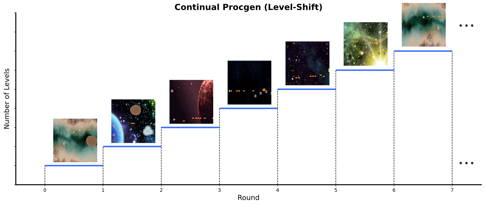
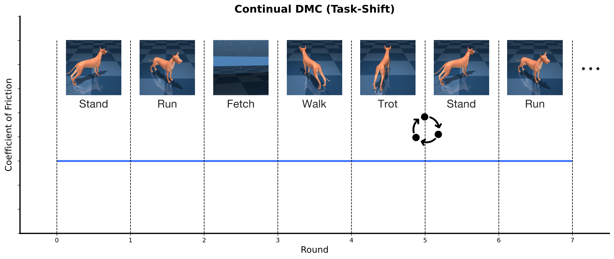

<div align=center>
<p align="center"></p>

# Accelerating Research in Plasticity-Motivated Deep Reinforcement Learning
    <a href="https://discord.gg/YGApGaXAHW"></a> <a href="https://arxiv.org/pdf/2504.17490"></a> 


</div>

**Plasticine** is a library that provides high-quality implementations of plasticity loss mitigation methods in deep reinforcement learning. We highlight the features of **Plasticine** as follows:
- 📜 Strike a balance between "*single-file*" and "*modularized*" implementation;
- 🏞️ Support comprehensive continual RL Scenarios;
- 📊 Benchmarked implementation (13+ algorithms and 6+ plasticity metrics);
- 🧱 Easy combination of different plasticity enhancement strategies;
- ⚙️ Local reproducibility via seeding;
- 🧫 Experiment management with [Weights and Biases]().

> **Plasticine** is built on the top of [CleanRL](https://github.com/vwxyzjn/cleanrl). Thanks for the excellent project!

## Quick Start
- Create an environment and install the dependencies:
``` sh
conda create -n plasticine python=3.10
pip install -r requirements/requirements-ale.txt # for ALE
pip install -r requirements/requirements-procgen.txt # for Procgen
pip install -r requirements/requirements-dmc.txt # for DeepMind Control Suite
```

- Clone the repository and run the training script:
``` sh
git clone https://github.com/RLE-Foundation/Plasticine
cd Plasticine
# Train the PPO agent with the Plasticine methods on the continual Procgen benchmark
CUDA_VISIBLE_DEVICES=0 python plasticine/ppo_continual_procgen_plasticine.py \
        --env_id starpilot \
        --seed 1 \
        # --use_shrink_and_perturb \ 
        # --use_normalize_and_project \
        # --use_layer_resetting \
        # --use_trac_optimizer \
        # --use_kron_optimizer \
        # --use_parseval_regularization \
        # --use_regenerative_regularization \
        # --use_crelu_activation \
        # --use_dff_activation \
        # --use_redo \
        # --use_plasticity_injection \
        # --use_use_l2_norm \
        # --use_layer_norm 
```


## Architecture and Implementation
The architecture of Plasticine is as follows:


### Plasticine Algorithms

- Reset-based Intervention
  - [Shrink and Perturb](https://arxiv.org/pdf/1910.08475)
  - [Plasticity Injection](https://arxiv.org/pdf/2305.15555)
  - [ReDo](https://arxiv.org/pdf/2302.12902)
  - [Layer Resetting](https://arxiv.org/pdf/2205.07802)

- Normlization Techniques
  - [Layer Normalization](https://arxiv.org/pdf/2402.18762v1)
  - [Normalize-and-Project](https://arxiv.org/pdf/2407.01800) 

- Regularization Techniques
  - [L2 Regularization](https://arxiv.org/pdf/2402.18762)
  - [Regenerative Regularization](https://arxiv.org/pdf/2308.11958)
  - [Parseval Regularization](https://arxiv.org/pdf/2412.07224)

- Activation Functions
  - [CReLU Activation](https://arxiv.org/pdf/2303.07507)
  - [Deep Fourier Features](https://arxiv.org/pdf/2410.20634)

- Optimizer
  - [TRAC](https://arxiv.org/pdf/2405.16642)
  - [KRON](https://arxiv.org/pdf/2506.15544)


### Plasticine Metrics
- Ratio of Dormant Units
- Fraction of Active Units
- Stable Rank
- Effective Rank
- Gradient Norm
- Weight Difference

### Plasticine Environments
- ALE


- Continual Procgen (Intra-task Switch)




- Continual DMC (Inter-task Switch)



## Benchmark Experiments

Please refer to [Plasticine's W&B Space](https://wandb.ai/yuanmingqi/Plasticine/reportlist) for a collection of Weights and Biases reports showcasing the benchmark experiments.


## Cite Us
If you use Plasticine in your work, please cite our paper:
``` bib
@article{yuan2026plasticine,
  title={Plasticine: Accelerating Research in Plasticity-Motivated Deep Reinforcement Learning},
  author={Yuan, Mingqi and Wang, Qi and Ma, Guozheng and Sun, Caihao and Li, Bo and Jin, Xin and Wang, Yunbo and Yang, Xiaokang and Zeng, Wenjun and Tao, Dacheng and Chen, Jiayu},
  journal={arXiv preprint arXiv:2504.17490},
  year={2026}
}
```

## Acknowledgement

We thank the high-performance computing center at INFIFORCE Intelligent Technology Co., Ltd., Eastern Institute of Technology, and Ningbo Institute of Digital Twin for providing the computing resources. Some code of this project is borrowed or inspired by several excellent projects, and we highly appreciate them.
